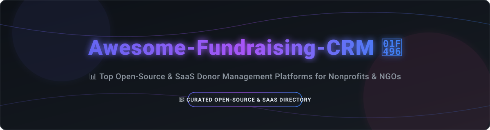

  

  # 📊 Awesome-Fundraising-CRM 💖

  ### 🚀 Top Fundraising CRM, Donor Management Platforms & Non-Profit Software

      

 

> 🎯 **A curated, SEO-optimized directory of leading fundraising CRMs, open-source constituent relationship management tools, donor databases, and non-profit giving platforms.** 
> Designed to empower non-profits, NGOs, charities, and fundraisers to find the best tools for constituent relationship management, gift tracking, peer-to-peer campaigns, stewardship, and donor retention.

---

## 📑 Table of Contents
- [🌟 Overview](#-overview)
- [🏢 SaaS & Hosted Platforms](#-saas--hosted-platforms)
- [💻 Open-Source Softwares & Frameworks](#-open-source-softwares--frameworks)
- [🛠️ Specialized Tools & Extensions](#-specialized-tools--extensions)
- [⚡ Quick Start Recommendations](#-quick-start-recommendations)
- [📈 Star History](#-star-history)
- [🤝 Contributing](#-contributing)

---

## 🌟 Overview

Fundraising software and non-profit CRM platforms enable organizations to effectively streamline donor management, automate gift processing, manage capital campaigns, and drive constituent stewardship. 

- 🔓 **Open-Source Leadership:** Complete data ownership, self-hosting flexibility, zero license costs, and extensive custom extensibility.
- ☁️ **SaaS & Hosted Solutions:** Turnkey donor management, built-in payment processing, AI wealth screening, and hands-free support.

---

## 🏢 SaaS & Hosted Platforms

| Platform | Company Scale / Valuation / Revenue | Description | Key Focus | Pricing | Free Tier / Trial Limits |
|----------|-----------------------------------|-------------|-----------|---------|--------------------------|
| **[Blackbaud Raiser’s Edge NXT](https://www.blackbaud.com/)** 🏛️ | ~$1.1B Annual Revenue (~$4B Market Cap) | Enterprise-grade constituent and fundraising CRM with deep relationship data, AI insights, annual fund tools, and extensive ecosystem integrations. | Enterprise fundraising CRM | From ~$3,000/yr ($250/mo equivalent) custom annual contracts | No free tier or standard free trial (demo available) |
| **[EveryAction](https://www.bonterratech.com/)** (Bonterra) 🏛️ | ~$800M Revenue (Bonterra Parent Group) | Unified CRM and fundraising platform (formerly EveryAction) focused on engagement, automation, moves management, and multi-channel campaigns. | Engagement & multi-channel fundraising | Custom quote-based (typically from ~$109/mo for base modules) | No free tier or free trial (demo available) |
| **[Bloomerang](https://bloomerang.co/)** 📈 | ~$100M+ ARR (Valued ~$500M+) | Donor management CRM focused on retention, engagement scoring, constituent timelines, and easy-to-use fundraising tools for small to mid-sized nonprofits. | Donor retention & engagement | From $125/mo (billed annually) for CRM (or $40/mo for basic Fundraising) | No free tier or free trial (demo available) |
| **[DonorPerfect](https://www.donorperfect.com/)** 💼 | ~$60M+ Annual Revenue | Comprehensive donor management and fundraising software with robust reporting, marketing tools, gift tracking, and scalability for growing organizations. | Full-featured donor management | From $99/mo | No free tier or free trial (demo available) |
| **[Neon CRM](https://www.neoncrm.com/)** (Neon One) 🌟 | ~$40M+ Annual Revenue | Flexible nonprofit CRM combining donor management, online fundraising, events, memberships, and email tools with strong reporting and automation. | All-in-one nonprofit CRM | From $99/mo | No free tier or free trial (demo available) |
| **[Donorbox](https://donorbox.org/)** 🚀 | ~$25M+ Annual Revenue | Online fundraising platform with donation forms, peer-to-peer campaigns, events, and a lightweight CRM for managing donors and recurring gifts. | Online giving + simple CRM | $0/mo base (2.95% platform fee per donation) | Free plan available with unlimited contacts/donations; paid Pro plan from $150/mo |
| **[Kindful](https://www.kindful.com/)** 🔗 | ~$20M+ ARR (Acquired by Bloomerang) | Nonprofit CRM with fundraising analytics, donation tracking, and marketing integrations aimed at growing organizations that want connected tools. | Fundraising CRM + integrations | From $100/mo | No free tier or free trial (demo available) |
| **[Givebutter](https://www.givebutter.com/)** 🧈 | ~$15M+ ARR (Raised $50M+) | Free/affordable all-in-one fundraising platform with donation forms, peer-to-peer, events, ticketing, and built-in CRM for unlimited contacts. | Free/affordable fundraising + CRM | $0/mo base (0% platform fee with optional donor tipping, or 3% fee) | Free plan includes unlimited contacts, campaigns, & emails; paid Plus plan from $29/mo |
| **[Little Green Light](https://www.littlegreenlight.com/)** 🌿 | ~$10M+ Annual Revenue | Flexible, cloud-based donor management and fundraising platform popular with small-to-mid nonprofits for gift tracking, reporting, and customization. | Affordable donor management | From $45/mo for up to 2,500 constituents | 30-day full-featured free trial (no credit card required) |
| **[Keela](https://www.keela.co/)** 🤖 | ~$5M - $10M Annual Revenue | Nonprofit CRM with smart donation asks, marketing automation, wealth screening insights, and tools designed to help teams raise more efficiently. | Smart fundraising & automation | From $125/mo for up to 1,000 contacts | 14-day free trial (no credit card required) |

---

## 💻 Open-Source Softwares & Frameworks

The list below is sorted by **GitHub Star Count** (descending).

| Project | GitHub_Stars | Description | License | Notes |
|---------|--------------|-------------|---------|-------|
| **[Apache Superset](https://github.com/apache/superset)** 📊 |  | Modern open-source data exploration & visualization platform used for high-level donor analytics & executive fundraising dashboards. | Apache-2.0 | Advanced BI dashboards & donor analytics |
| **[Twenty](https://github.com/twentyhq/twenty)** ⚡ |  | Modern open-source CRM alternative providing full data control and extensible object schemas easily adaptable for donor management. | AGPL-3.0 | Modern CRM architecture & customizable objects |
| **[Metabase](https://github.com/metabase/metabase)** 📈 |  | The simplest, fastest open-source analytics & business intelligence tool to query donor databases and view fundraising trends. | AGPL-3.0 | Easy self-hosted donor reporting & insights |
| **[Formbricks](https://github.com/formbricks/formbricks)** 📋 |  | Open-source experience management & survey tool to collect donor feedback, campaign insights, and volunteer registrations. | AGPL-3.0 | Donor surveys & feedback forms |
| **[ERPNext](https://github.com/frappe/erpnext)** 🏗️ |  | 100% open-source ERP with dedicated Non-Profit module for managing grants, donor memberships, chapter chapters, and accounting. | GPL-3.0 | Comprehensive nonprofit ERP & grant tracking |
| **[HeyForm](https://github.com/heyform/heyform)** 📝 |  | Open-source online drag-and-drop form builder for creating engaging donation forms, event signups, and survey flows. | AGPL-3.0 | Interactive donation & pledge forms |
| **[SuiteCRM](https://github.com/SuiteCRM/SuiteCRM)** 🏢 |  | Enterprise-grade open-source CRM platform providing robust contact tracking, workflow automation, and custom constituent portals. | AGPL-3.0 | Highly customizable constituent CRM |
| **[EspoCRM](https://github.com/espocrm/espocrm)** 🎯 |  | Web-based open-source CRM application that allows tracking of relationships, accounts, campaigns, and donor interactions. | GPL-3.0 | Flexible relational CRM foundation |
| **[CiviCRM](https://github.com/civicrm/civicrm-core)** 🏆 |  | The gold standard open-source CRM built specifically for non-profits, NGOs, and advocacy groups. Handles contacts, contributions, memberships, events, and mailings. | AGPL-3.0 | Most complete open-source fundraising CRM |
| **[Salesforce NPSP](https://github.com/SalesforceFoundation/NPSP)** ☁️ |  | Open-source managed package extending Salesforce into a donor CRM with household management and fundraising data models. | BSD-3-Clause | Powerful open data model on Salesforce platform |

---

## 🛠️ Specialized Tools & Extensions

- 💳 **Online Giving & Form Builders:** Open-source form tools like [Formbricks](https://github.com/formbricks/formbricks) and [HeyForm](https://github.com/heyform/heyform) connected via webhooks to payment processing endpoints.
- ✉️ **Email Stewardship & Communication:** [CiviCRM](https://github.com/civicrm/civicrm-core)'s native CiviMail or self-hosted mailing setups for automated campaign appeals and donor thank-you workflows.
- 📊 **Analytics & Reporting Engines:** Dashboards built on [Apache Superset](https://github.com/apache/superset) or [Metabase](https://github.com/metabase/metabase) connected directly to SQL backends.
- 🔄 **ERP & Accounting Reconciliation:** [ERPNext](https://github.com/frappe/erpnext) Non-Profit module for multi-currency grant tracking, membership subscriptions, and ledger auditability.

---

## ⚡ Quick Start Recommendations

| Goal | Recommended Starting Point |
|------|---------------------------|
| 🏆 **Best full open-source nonprofit CRM** | **CiviCRM** |
| 📊 **Best open-source data analytics** | **Apache Superset** or **Metabase** |
| 🏗️ **Best open-source ERP with Nonprofit module** | **ERPNext** |
| ⚡ **Best modern extensible open-source CRM** | **Twenty** |
| ☁️ **Open-source on Salesforce platform** | **Salesforce NPSP** (with Power of Us licenses if eligible) |
| 💖 **Donor retention focus & ease of use** | **Bloomerang** |
| 🏛️ **Enterprise constituent management** | **Blackbaud Raiser’s Edge NXT** |
| 🌟 **Flexible mid-market nonprofit CRM** | **Neon CRM** or **DonorPerfect** |
| 🧈 **Free / low-cost online fundraising + light CRM** | **Givebutter** or **Donorbox** |
| 🌿 **Affordable growing nonprofit CRM** | **Little Green Light** or **Kindful** |
| 🤖 **Smart asks & automation** | **Keela** |

---

## 📈 Star History

<a href="https://www.star-history.com/?repos=ishandutta2007%2FAwesome-Fundraising-CRM&type=date&legend=bottom-right">
<picture>
<source media="(prefers-color-scheme: dark)" srcset="https://api.star-history.com/chart?repos=ishandutta2007/Awesome-Fundraising-CRM&type=date&theme=dark&legend=bottom-right" />
<source media="(prefers-color-scheme: light)" srcset="https://api.star-history.com/chart?repos=ishandutta2007/Awesome-Fundraising-CRM&type=date&legend=bottom-right" />

</picture>
</a>

---

## 🤝 Contributing

Contributions, updates, and new open-source projects or SaaS platform insights are always welcome! 

Please check out our list of awesome repositories at [Awesome-Awesome-Awesome](https://github.com/ishandutta2007/Awesome-Awesome-Awesome) and submit a pull request or issue.

---

**Last updated:** August 2026  
*Emphasizing open-source tools while documenting major commercial platforms for context. CiviCRM remains the definitive dedicated open-source fundraising CRM for non-profits.*
